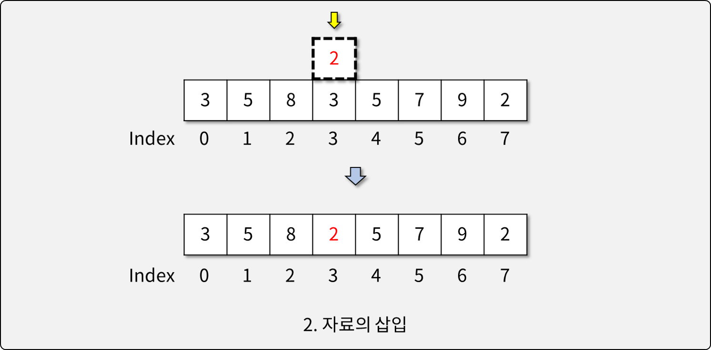
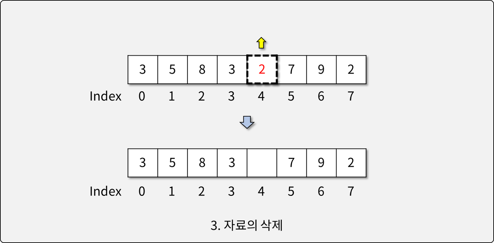

# 배열 (Arrays)

## 배열이란

- 다루는 자료의 수가 많아질 때, 이를 다루기 위해 사용하는 **자료 구조**
- 하나의 변수에 여러 자료를 저장할 수 있으며, 반복문을 이용해 효율적으로 처리 가능
- 배열에서 인덱스는 유일무이한 식별자(Identifier)로 사용된다.

## 배열의 특징

- 크기(Element의 개수)가 정해져 있다.
- 자료 구조에 기능(메소드)이 포함되어 있지 않다.
- 자료가 메모리상에 빈틈 없이 연속적으로 위치해 있다.
- 인덱스를 활용하여 자료에 빠르게 접근할 수 있다.

## 배열의 단점

- 배열의 길이는 생성 시 정해져, 변경할 수 없다.
  - 가변 길이 배열은 배열의 크기를 변경할 때 마다 새 배열을 만든다.
- Element를 제거할 경우, 배열에 빈 틈이 생긴다.
  - 기존 Element의 인덱스를 유지하기 위해 빈 틈을 유지한다.

## 배열의 활용

- 배열의 생성

- 자료의 삽입

- 자료의 삭제

- 자료의 색인


## Python과 배열

- Python의 List는 배열 자료구조와는 다르며, 고수준의 기능을 포함한다.
- Python에서는 배열과 유사한 자료구조로 array가 제공됨.
  - array.array 생성

    ```python
    import array
    arr = array.array('b', [10, 4, 22, -4, 9])
    ```

  - 타입 코드
  
    ```python
    import array
    print(array.typecodes)
    ```

    | 타입 코드 | C Type | Python Type | bytes |
    |----------|--------|-------------|-------|
    | b | signed char | int | 1 |
    | B | unsigned char | int | 1 |
    | u | Py_UNOCODE | Unicode Character | 2 |
    | h | signed short | int | 2 |
    | H | unsigned short | int | 2 |
    | i | signed int | int | 2 |
    | I | unsigned int | int | 2 |
    | l | signed long | int | 4 |
    | L | unsigned long | int | 4 |
    | q | signed long long | int | 8 |
    | Q | unsigned long long | int | 8 |
    | f | float | float | 4 |
    | d | double | float | 8 |

  - array는 특정 형식의 Element만을 허용한다.
  - array는 자료가 메모리에 연속적으로 배치되는 것을 보장한다.
  - 제공 메소드
    - append, extend, count, index, insert, pop, remove, reverse, tolist, fromlist ...
